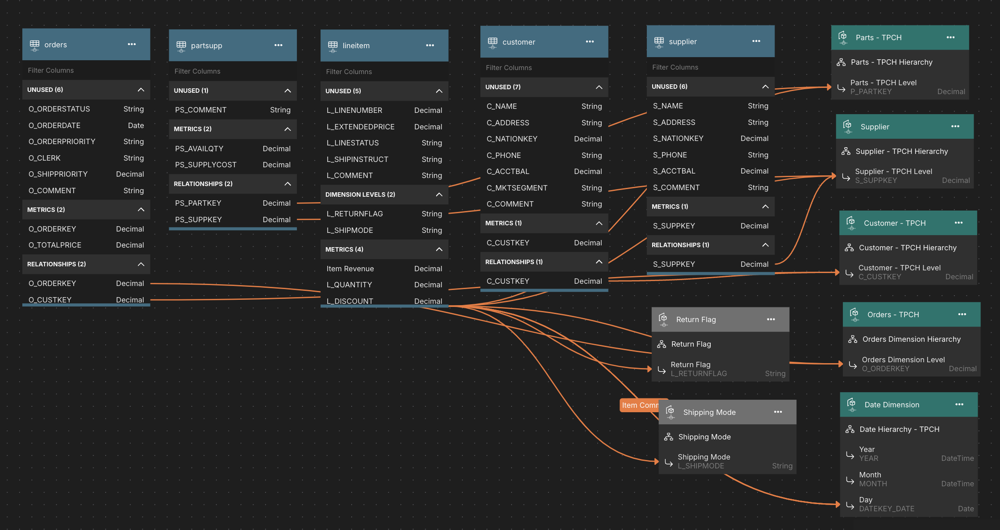

# TPC-H Model

The [TPC-H](https://www.tpc.org/tpch/) model dataset is a widely recognized benchmarking standard designed to evaluate the performance of data warehousing and business intelligence systems. TPC-H is a decision support benchmark. It consists of a suite of business oriented ad-hoc queries and concurrent data modifications. The queries and the data populating the database have been chosen to have broad industry-wide relevance. This benchmark illustrates decision support systems that examine large volumes of data, execute queries with a high degree of complexity, and give answers to critical business questions.

## Demonstrated Model Features
1. Multi-fact model
2. Calculated Columns
3. Time-relative calculations

## Supported Data Platforms
1. Snowflake

## Data Model Overview

## Data Loading Instructions

### How to Connect to Snowflake Data
1. The supporting data for TPC-H is already available in Snowflake's public data share in the `SNOWFLAKE_SAMPLE_DATA/TPCH_SFx` schemas. The SML connection object in this repository already points to the `SNOWFLAKE_SAMPLE_DATA/TPCH_SF1` schema.
2. The model requires a date table called `datecustom` to support the date dimension. Run the [CreateDateCustomTable.sql](data/CreateDateCustomTable.sql) SQL script in this repository to create the `datecustom` table and data that matches the TPC-H data.
3. Update the `Connection - DateCustom.yml` connection SML file to point to the database and schema where you created the `DateCustom` table.

